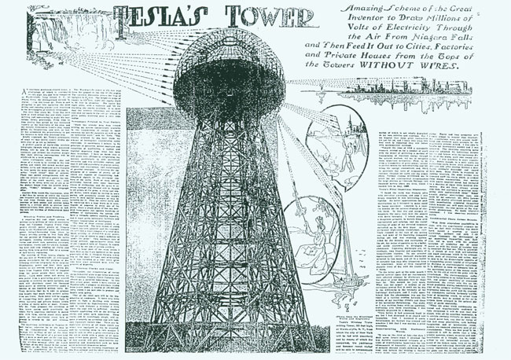
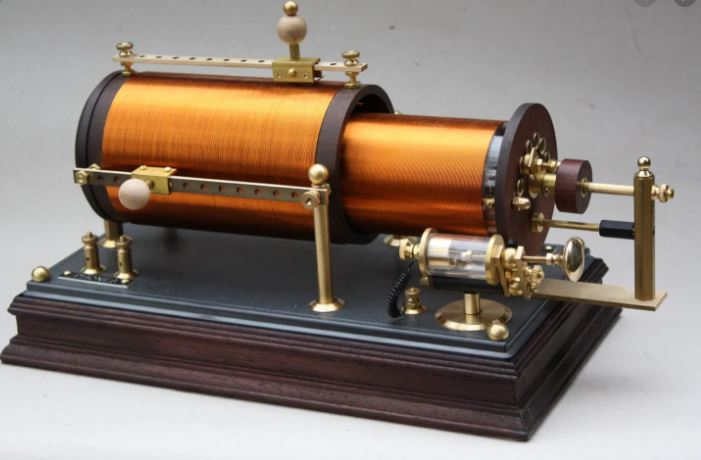
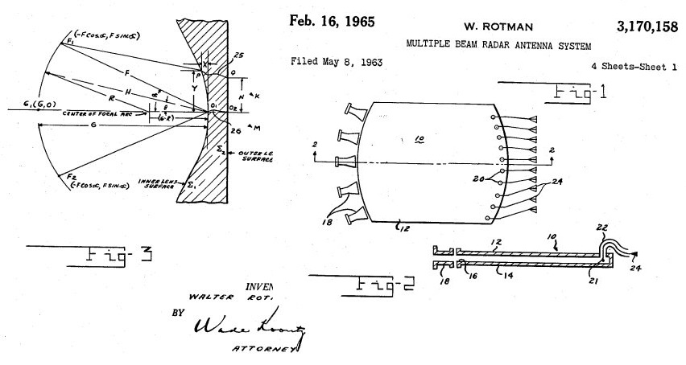
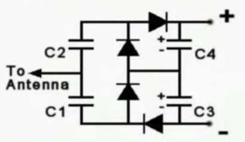
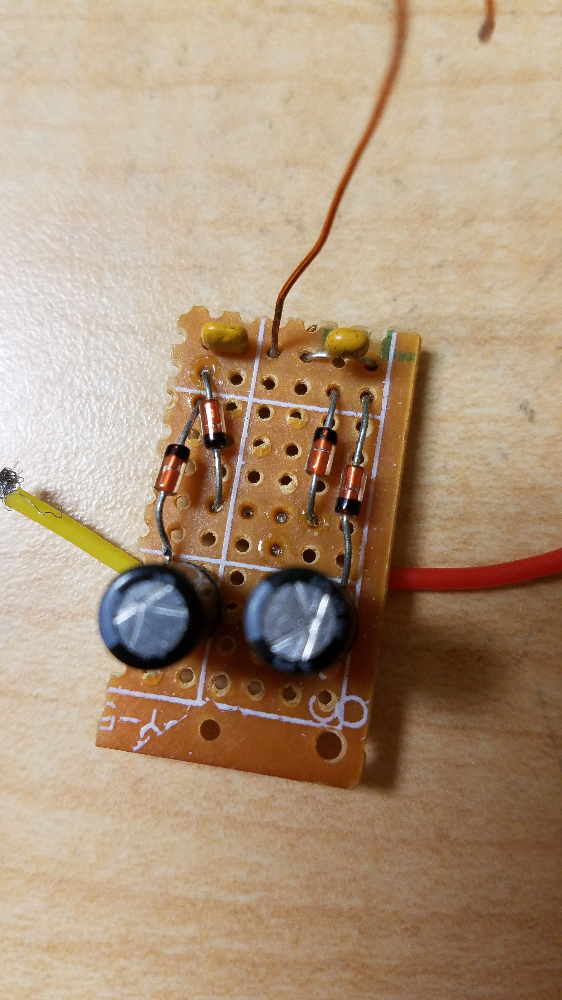
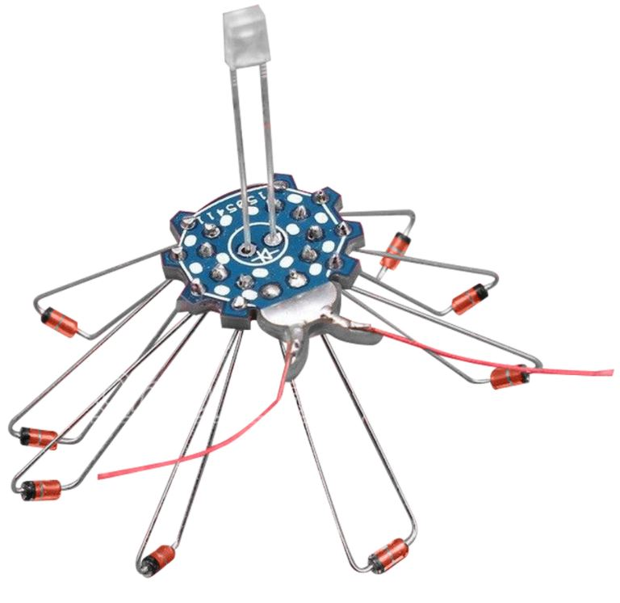
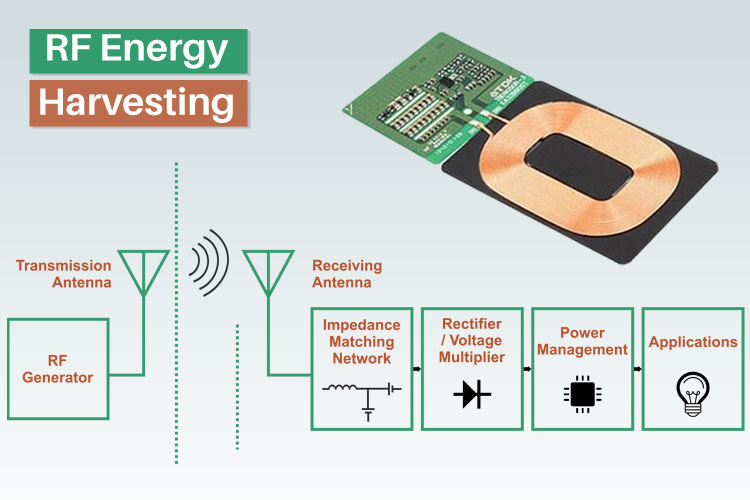

# Radio Frequency Energy Harvesting (RFEH) para dispositivos IoT Makers

RFEH es una forma de **técnica de transferencia de energía inalámbrica en la que las señales de radio Frecuencia (RF) recibidas se convierten en electricidad**. También conocido como barrido de energía de RF. El dispositivo de recolección de energía de RF puede proporcionar energía para dispositivos no conectados. Hay dos casos de uso: la captación de la señal RF para alimentar el propio demodulador y receptor de la señal para utilizarla como la antigua radio de galena o los actuales Tags de RFID. O capturar la energia de RF para alimentar un circuito con otro propósito como el de leer un sensor de temperatura.



## Su historia es larga
Allá por el año 1901 se empezó a construir una torre Wardenclyffe. Fué diseñada e ideada por el inventor Nikola Tesla con la intención de suministrar energía libre de forma inalámbrica. Y es ahora, 120 años después. Que otras torres, esta vez en forma de antenas van a lograr su sueño. 

Esta técnica no ha empezado dela mano del movimiento Maker actual, si no de los ingenieros que diseñaron las Radios de Galena. Eran dispositivos de recepción de emisiones de radio de Amplitud Modulada (AM) y Onda Media y que no necesitaban alimentación eléctrica ya que la tomaban a través de la antena. La señal se sintonizaba con una bobina y se rectificaba gracias a la propiedad de un cristal semiconductor de sulfuro de plomo, que es el mineral de galio de donde viene su nombre.



## Un servicio no deseable del 5G hará posible lo que Tesla no pudo acabar.

Los operadores están implementando redes 5G en todo el mundo, con la promesa de entregar datos ultrarrápidos a dispositivos de todas las formas y tamaños. Aunque hasta ahora esta tecnología no ha tenido mucho impacto en el usuario. Sin embargo, es posible que los arquitectos de la tecnología 5G hayan proporcionado, sin saberlo, la clave de la energía inalámbrica. Gracias a las ondas milimetricas utilizadas así como la gran potencia necesaria para su transmisión, por encima de los 10 KW por torre. 

Un equipo de la empresa Georgia Tech ha desarrollado una pequeña antena impresa en 3D que puede recolectar energía de ondas 5G.  
[](https://youtu.be/sNuFU3H5GR0)

El diseño de Georgia Tech se ha basado en una patente de una lente para radiofrecuencais del año 1965 de Walter Rotman. Es la lente Rotman, un metamaterial que permite que se formen múltiples haces de antena sin la necesidad de interruptores o desfasadores. 



## Manos a la obra DIY tu REFH
En el mundo Maker tenemos unos componentes más accesibles que son los diodos de germanio. Que es el componente que sucedió al cristal de galio para la recitificación de señal que ahora se ajusta más a la banda de la Frecuencia Modulada (FM). Así que si podremos montar nuestro dispositivo experimental con unos cuantos diodos de estos.

## Versión Maker.
Es importante tener en cuenta que no puede usa cualquier diodo. Deben poder manejar una frecuencia suficientemente alta y tener una caída de voltaje baja. Los más adecuados son los 1N34A que aunque tienen una caida de 1V segun las especificaciones, a las tensiones que los vamos a utilzar, esta caida es mucho menor. 



Para el montaje, se puede utilizar cualquier PCB de prototipo y con un soldador para conectar rápidamente todos los componentes. Es fundamental respetar la polaridad de los condensadores electrolíticos y los diodos. Para los dos condensadores que conectan la antena al circuito, se utilizan condensadores cerámicos que no necesitan estar conectados con una cierta polaridad. 

La antena será nuestro elemento de ajuste. Se puede empezar probando con una antena de 1/4 de la longitud de onda de FM. Si banda de radio FM va desde 88 a 108 MHz y estimamos una central de 100Mhz:

```
Longitud de onda = 3*10E8(m/s) / 1E8(Hz) = 3m 
Longitud de la antena: 3/4 m = 75cm
```

## Versión DIY
Este kit está diseñado para captar la señal GSM y encender un diodo LED. El montaje es trivial, soldar y pegar.


[Link de compra del ICSK032A ](https://a.aliexpress.com/_mNyx4dj)

## Proximamente: Alimentación de un sensor IoT


(Continuará...)

# Agradecimientos:
[ProteusH](https://steemit.com/technology/@proteus-h/my-diy-radio-wave-energy-harvesting-circuit)
